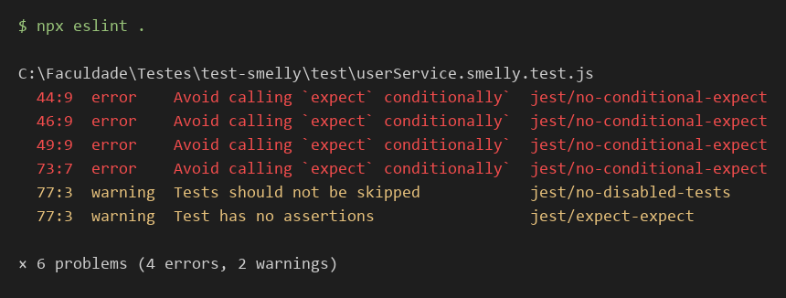

# Refatoração de Testes e Detecção de Test Smells

**Disciplina:** Teste de Software
**Aluno:** Arlindo Sérgio Pereira Junior
**Matrícula:** 856882
**Repositório:** https://github.com/ArlindoSPJr/test-smelly

---

## 1. Análise de Smells

### 1.1 Lógica condicional (linhas 40-51)

O teste usa `for` e `if/else`, então cada `expect` só roda em um dos ramos e o fluxo depende dos dados.

- **Por que é um mau cheiro:** o teste deixa de ser linear e mistura dois cenários (desativar comum e desativar admin).
- **Risco:** se o ramo errado for executado, ou o valor de `isAdmin` mudar, o teste pode passar sem verificar o que deveria, e uma falha não diz qual cenário quebrou.

### 1.2 `try/catch` sem falha (linhas 70-74)

O `expect` fica dentro do `catch`.

- **Por que é um mau cheiro:** se a exceção não for lançada, nenhuma asserção roda e o teste passa.
- **Risco:** falso positivo. Ao remover a validação de idade de `src/userService.js`, o teste original continuou verde, enquanto o teste refatorado falhou com "Received function did not throw". A regra de negócio poderia ser apagada sem que a suíte avisasse.

### 1.3 Teste frágil (linhas 60-63)

O teste exige o texto literal `` `ID: ${usuario1.id}, Nome: Alice, Status: ativo\n` `` e o cabeçalho do relatório.

- **Por que é um mau cheiro:** está acoplado ao formato de saída, não ao comportamento.
- **Risco:** trocar uma vírgula ou a ordem dos campos quebra o teste sem haver bug, o que gera falsos alarmes e custo de manutenção, e a equipe passa a ignorar falhas.

Outros smells (múltiplos cenários por teste, Convidado misterioso, dado criado sem asserção, teste ignorado e estado global) estão registrados em [`docs/analise-manual.md`](../analise-manual.md).

---

## 2. Processo de Refatoração

Teste escolhido: `deve desativar usuários se eles não forem administradores`, o mais problemático, com 3 cenários, um laço, um `if/else` e asserções condicionais.

### Antes (`userService.smelly.test.js`, linhas 33-52)

```js
  test('deve desativar usuários se eles não forem administradores', () => {
    const usuarioComum = userService.createUser('Comum', 'comum@teste.com', 30);
    const usuarioAdmin = userService.createUser('Admin', 'admin@teste.com', 40, true);

    const todosOsUsuarios = [usuarioComum, usuarioAdmin];

    // O teste tem um loop e um if, tornando-o complexo e menos claro.
    for (const user of todosOsUsuarios) {
      const resultado = userService.deactivateUser(user.id);
      if (!user.isAdmin) {
        // Este expect só roda para o usuário comum.
        expect(resultado).toBe(true);
        const usuarioAtualizado = userService.getUserById(user.id);
        expect(usuarioAtualizado.status).toBe('inativo');
      } else {
        // E este só roda para o admin.
        expect(resultado).toBe(false);
      }
    }
  });
```

### Depois (`userService.clean.test.js`, bloco `deactivateUser`)

```js
describe('deactivateUser', () => {
  test('deve retornar true ao desativar um usuário comum', () => {
    // Arrange
    const usuario = userService.createUser('Comum', 'comum@teste.com', 30);
    // Act
    const resultado = userService.deactivateUser(usuario.id);
    // Assert
    expect(resultado).toBe(true);
  });
  test('deve alterar o status do usuário comum para inativo', () => {
    // Arrange
    const usuario = userService.createUser('Comum', 'comum@teste.com', 30);
    // Act
    userService.deactivateUser(usuario.id);
    // Assert
    expect(userService.getUserById(usuario.id).status).toBe('inativo');
  });
  test('deve retornar false ao tentar desativar um administrador', () => {
    // Arrange
    const admin = userService.createUser('Admin', 'admin@teste.com', 40, true);
    // Act
    const resultado = userService.deactivateUser(admin.id);
    // Assert
    expect(resultado).toBe(false);
  });
  test('deve manter o administrador ativo após a tentativa de desativação', () => {
    // Arrange
    const admin = userService.createUser('Admin', 'admin@teste.com', 40, true);
    // Act
    userService.deactivateUser(admin.id);
    // Assert
    expect(userService.getUserById(admin.id).status).toBe('ativo');
  });
  test('deve retornar false ao desativar um id inexistente', () => {
    // Act
    const resultado = userService.deactivateUser('id-inexistente');
    // Assert
    expect(resultado).toBe(false);
  });
});
```

### Decisões tomadas

- **Um cenário por teste:** os 3 cenários viraram testes separados (retorno e estado do usuário comum, retorno do admin). Foi acrescentado o que faltava: o admin continua *ativo*.
- **Sem `for` e `if`:** cada teste cria seus próprios usuários e todo `expect` sempre executa.
- **Arrange, Act, Assert:** as três fases estão marcadas em cada teste.
- **Nomes descritivos:** o nome diz o resultado esperado, por exemplo "deve retornar false ao tentar desativar um administrador".
- **Dados dentro do teste:** não há mais o objeto compartilhado do topo do arquivo (Convidado misterioso).

No restante do arquivo, o `try/catch` virou `expect(fn).toThrow(mensagem)`, o relatório passou a ser verificado com `toContain` (id, nome e status) em vez do texto exato, e o `test.skip` vazio foi implementado (relatório sem usuários).

---

## 3. Relatório da Ferramenta (ESLint)



**Como a ferramenta automatizou a detecção:** em segundos, o ESLint apontou a linha exata e a regra violada: `jest/no-conditional-expect` nas linhas 44, 46 e 49 (lógica condicional) e 73 (`try/catch`), `jest/no-disabled-tests` e `jest/expect-expect` na linha 77 (teste ignorado e vazio). O resultado é repetível e pode rodar a cada commit.

**Comparação com a análise manual:** o ESLint detectou 3 dos 8 smells encontrados manualmente (e ainda apontou o teste vazio). Não detectou múltiplos cenários, teste frágil, Convidado misterioso, dado sem asserção nem estado global, pois dependem de interpretar a intenção do teste. As duas abordagens se complementam.

**Validação final:** `npx eslint test/userService.clean.test.js` não reporta erros nem avisos, e `npm test` passa nas duas suítes (21 testes passando e 1 pulado, do arquivo original).

---

## 4. Conclusão

Cobertura alta não garante qualidade: o teste com `try/catch` executava o código e ainda assim não protegia a regra de maioridade. Testes limpos (um cenário, AAA, sem lógica condicional, verificando comportamento e não formato) falham quando deveriam e só quando deveriam, o que reduz falsos positivos e o custo de manutenção. A análise estática com ESLint barateia esse cuidado ao detectar automaticamente os smells estruturais, mas não substitui a leitura crítica dos smells semânticos. Usar as duas juntas torna a suíte mais confiável e sustentável ao longo do projeto.
